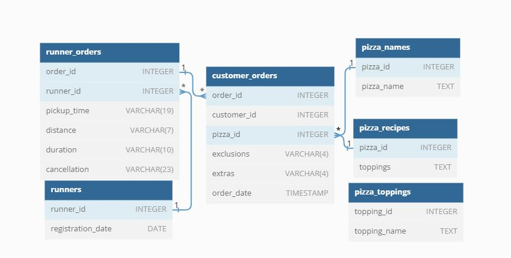

# Pizza_Runner

### _Link to the 8weeksqlchallenge organized by Danny Ma_ [Click here to view all challenge](https://8weeksqlchallenge.com/case-study-2/)
----
# Introduction
Danny was scrolling through his Instagram feed when something really caught his eye - “80s Retro Styling and Pizza Is The Future!”

Danny was sold on the idea, but he knew that pizza alone was not going to help him get seed funding to expand his new Pizza Empire - so he had one more genius idea to combine with it - he was going to Uberize it - and so Pizza Runner was launched!

Danny started by recruiting “runners” to deliver fresh pizza from Pizza Runner Headquarters (otherwise known as Danny’s house) and also maxed out his credit card to pay freelance developers to build a mobile app to accept orders from customers. 

Because Danny had a few years of experience as a data scientist - he was very aware that data collection was going to be critical for his business’ growth.

# Problem Statement 
Danny has prepared for us an entity relationship diagram of his database design but requires further assistance to clean his data and apply some basic calculations so he can better direct his runners and optimise Pizza Runner’s operations.

# Entity Relationship Diagram 

Click on the [Link](https://dbdiagram.io/d/5f3e085ccf48a141ff558487/?utm_source=dbdiagram_embed&utm_medium=bottom_open) to navigate to the site when the data model was generated. Click [here](https://github.com/Aosanusi30/Case-Study-2---Pizza-Runner/commit/93822accac78ecff03b8fdcffe179678dfe01c1d) from SQL code 

# Case Study 
This case study has LOTS of questions - they are broken up by area of focus including:

- Data Cleaning
- Pizza Metrics
- Runner and Customer Experience
- Ingredient Optimisation
- Pricing and Ratings
- Bonus DML Challenges (DML = Data Manipulation Language)
